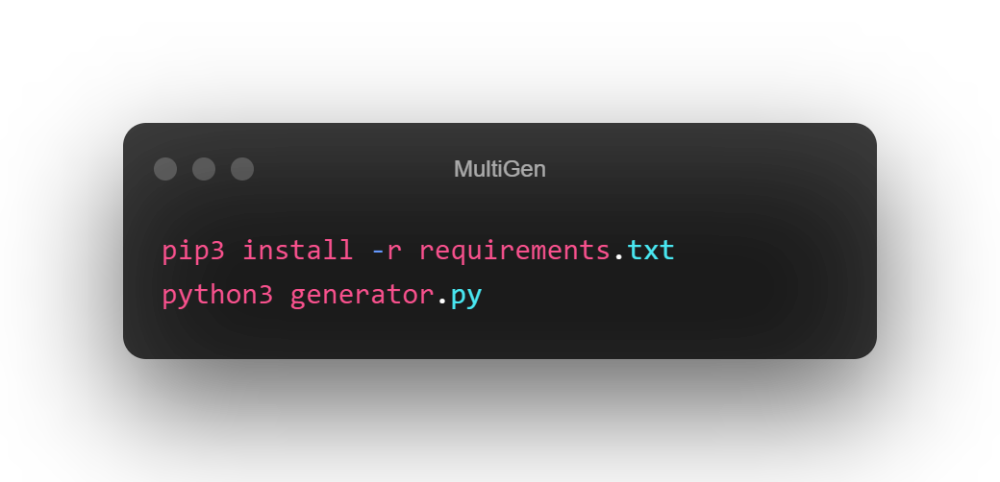

<p align="center"></p>
<div align="center" style="margin-top: 0;">
   <p>Dont Skid 👀</p>
</div>
<em><h5 align="center">(Programming Language - Python 3)</h5></em>
<p align="center">
<a href="#"></a>
<a href="#"></a>
<a href="#"></a>
<a href="https://github.com/BlackSnowDot/MultiAccountGenerator/issues"></a>
<p align="center"></p>

---

<p align="center"></p>

## 📝 Document
### Don't Use Vpn or Proxy!
**Install Requirements**

```
pip3 install -r requirements.txt
```

**Run Script**
```shell
python3 generator.py
```

### Note: You Can Change Something in `config.json`

## 📝 ToDo

1. [ ] More Websites
2. [ ] Async

<h6 align="center" style="color: #25DCF9">You Can't Give me 1 str :(?</h6>
