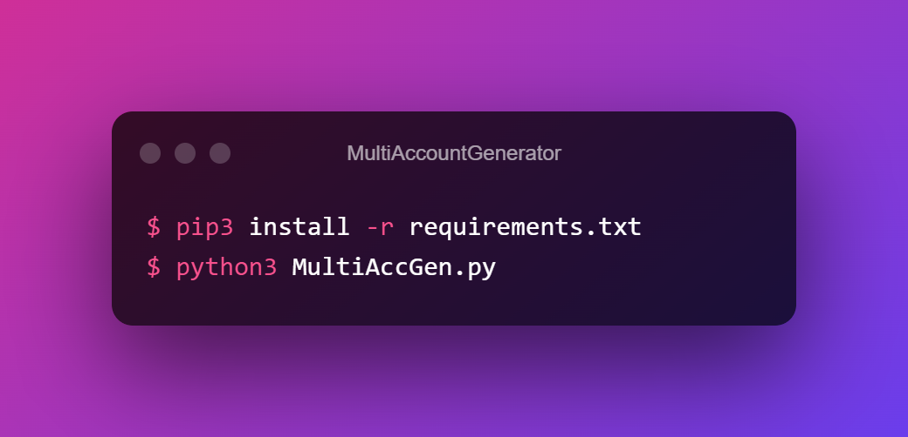

<h1 align="center" style="margin-top: 0px;">MultiAccountGenerator</h1>
Generate Minecraft/NordVPN/Hulu/Origin And ...

Open MultiAccGen.py with notepad++ or Something and put your webhook in Line 11 or Ignore This

you can change speed in McAccGen.py Line 12

Features: Discord Webhook Support | Thread Support

 ## 🥅 ・Goals

・ 30 star config file

・ 40 star rebase + more websites

#### idk why people like this script but okey
