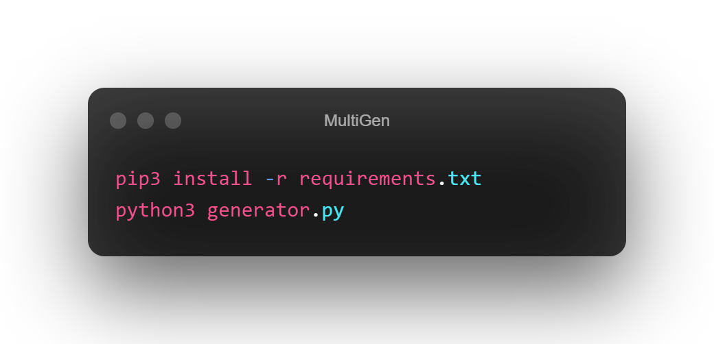

<p align="center"></p>
<div align="center" style="margin-top: 0;">
   <p>Don't Skid 👀</p>
</div>
<em><h5 align="center">(Programming Language - Python 3)</h5></em>
<p align="center">
<a href="#"></a>
<a href="#"></a>
<a href="#"></a>
<a href="https://github.com/BlackSnowDot/MultiAccountGenerator/issues"></a>
<p align="center"></p>

---

<p align="center"></p>


## 📝 Document 👀
### ⚠️ Don't Use Vpn or Proxy! 🔒
## Note: The links you click on have ads (advertisements). Just avoid them.

**Download** 👽
```
git clone https://github.com/MatrixTM/MultiAccountGenerator.git
```
or download zip from [Here](https://github.com/MatrixTM/MultiAccountGenerator/archive/refs/heads/main.zip)

**Install Requirements** 💻

```
pip install -r requirements.txt
```
Also you can use install.bat for windows 💸

**Run Script** 🚀
```shell
python3 generator.py
```
Also you can use run.bat for windows

### Note: You Can Change urls in config.json 📝
### Also, You Can see some Screenshots from [Here](https://github.com/BlackSnowDot/MultiAccountGenerator/tree/main/screenshots) 📸

Maybe This Video Help You 📹

https://user-images.githubusercontent.com/95581741/199072993-e7705478-e68d-4074-b3b3-8d7c5dce85b7.mp4


---
## 📝 ToDo

1. [ ] More Websites
2. [x] Async

<h6 align="center" style="color: #25DCF9">Can't You Give me even 1 star :(?</h6>

## Need a Cheap Server? 

<a href="https://pfcloud.io/aff.php?aff=80"></a>
#### You can buy an 10Gbps cheap server from [PFcloud Hosting](https://pfcloud.io/aff.php?aff=80) with crypto (100% anonymous).
